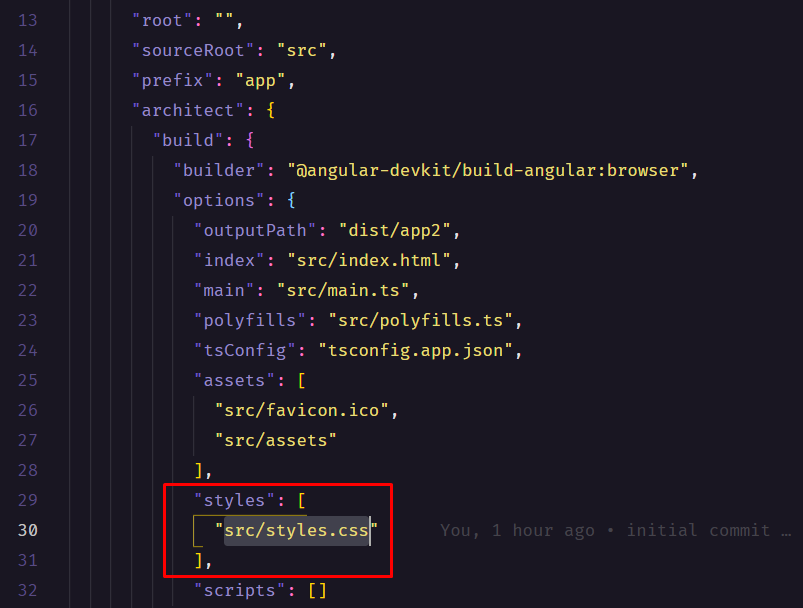
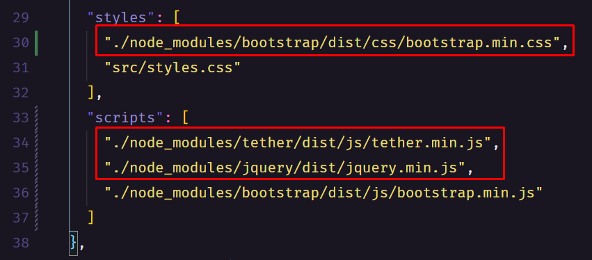

## Adicionando Dependências

Boostrap 4
<code>npm install bootstrap@4.0.0 --save</code>

JQuery
<code>npm install jquery@3.2.1 --save</code>

Tether
<code>npm install tether@1.4.0 --save</code>

## Configurando Dependências
Abra o arquivo <code>angular.json</code> e procure por:

Agora adicione as seguintes linhas em "Styles" e "Scripts":

